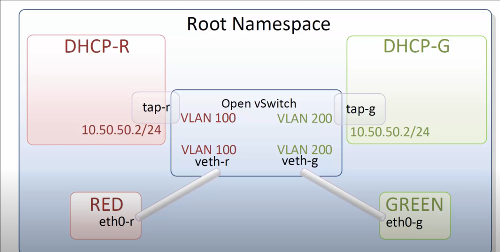
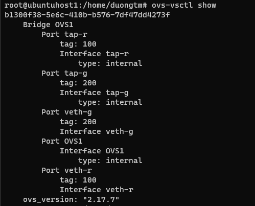
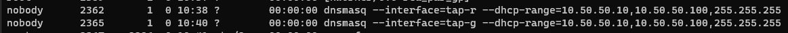
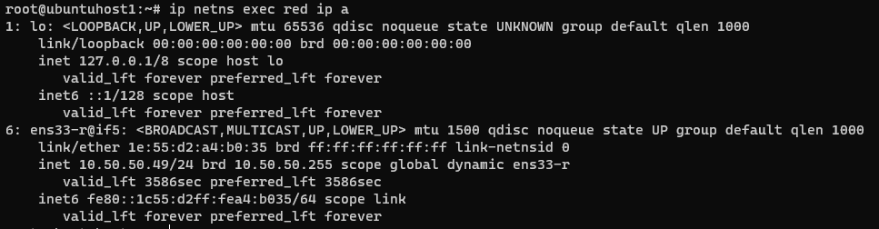
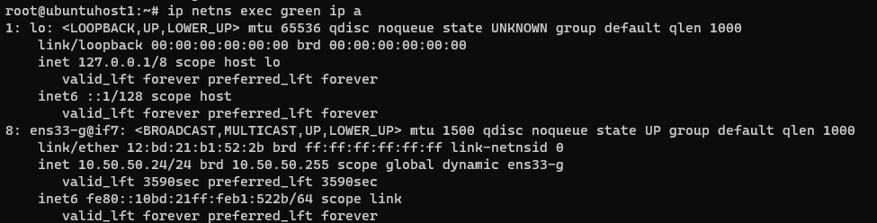

# DHCP Lab

## 1. Giới thiệu

### 1.1. DHCP

Dynamic Host Configuration Protocol là một giao thức cho phép cấp phát địa chỉ IP một cách tự động cùng với các cấu hình liên quan khác như subnet mask và gateway mặc định. Máy tính được cấu hình một cách tự động vì thế sẽ giảm việc can thiệp vào hệ thống mạng. Nó cung cấp một database trung tâm để theo dõi tất cả các máy tính trong hệ thống mạng. Mục đích quan trọng nhất là tránh trường hợp hai máy tính khác nhau lại có cùng địa chỉ IP.

### 1.2. dnsmasq

dnsmasq là một ứng dụng nhẹ, dễ cấu hình được sử dụng để cung cấp dịch vụ DNS và DHCP. Nó thường được dùng trong các mạng nhỏ và trung bình hoặc làm phần của môi trường phát triển cục bộ. Dnsmasq được thiết kế để cung cấp các dịch vụ DNS và DHCP với hiệu suất tối thiểu và sử dụng tài nguyên thấp.

## 2. Thực hành

### 2.1. Mô hình

Topology lấy ý tưởng từ Openstack.
Mô hình sử dụng network namespace để giả lập các node cô lập với nhau. 2 namespace `red` và `green`  giả lập 2 máy ảo nằm trên 2 VLAN khác nhau. 2 namespace `DHCP-R` và `DHCP-G` là DHCP server tương ứng cấp IP cho 2 host trên.



### 2.2. Tiến hành

#### 2 namespace `red` và `green`
Hai namespace `red` và `green` được tạo từ lab trước (Linux network namespace).

Để cô lập 2 host, sử dụng VLAN trên openvswitch. `red` thuộc VLAN 100, `green` thuộc VLAN 200.
```bash
ovs-vsctl set port veth-r tag=100
ovs-vsctl set port veth-g tag=200
```

Vì trước đó `red` và `green` được gán IP nên giờ cần xoá đi.
```bash
ip netns exec red ip address del 10.0.0.1/24 dev ens33-r
ip netns exec green ip address del 10.0.0.2/24 dev ens33-g
```

#### 2 namespace `dhcp-r` và `dhcp-g`

```bash
ip netns add dhcp-r
ip netns add dhcp-g
```

#### Kết nối `dhcp-r` và `dhcp-g` với openvswitch
 
Để kết nối `dhcp-r` và `dhcp-g` với OVS1, em dùng **Internal port** của ovs, không thông qua `veth pair` như `red` và `green`.

Tạo port `tap-r` và `tap-g`
```bash
ovs-vsctl add-port OVS1 tap-r
ovs-vsctl set interface tap-r type=internal
ovs-vsctl set port tap-r tag=100
```

```bash
ovs-vsctl add-port OVS1 tap-g
ovs-vsctl set interface tap-g type=internal
ovs-vsctl set port tap-g tag=200
```



Chuyển các interface vào namespace tương ứng:
```bash
ip link set tap-r netns dhcp-r
ip link set tap-g netns dhcp-g
```

#### Cấu hình các interface

Interface trên `dhcp-r`
```bash
ip netns exec dhcp-r bash
ip link set dev lo up
ip link set dev tap-r up
ip address add 10.50.50.2/24 dev tap-r
```


Interface trên `dhcp-g
```bash
ip netns exec dhcp-g bash
ip link set dev lo up
ip link set dev tap-g up
ip address add 10.50.50.2/24 dev tap-g
```

 `tap-r` và `tap-g` có thể có chung IP `10.50.50.2` vì chúng cô lập với nhau. Các tenant cũng có thể có IP trùng nhau nhờ network namespace và VLAN.

Cấu hình DHCP server:
```bash
ip netns exec dhcp-r dnsmasq --interface=tap-r \
 --dhcp-range=10.50.50.10,10.50.50.100,255.255.255.0
```

```bash
ip netns exec dhcp-g dnsmasq --interface=tap-g \
 --dhcp-range=10.50.50.10,10.50.50.100,255.255.255.0
```

Tuy `dhcp-range` giống nhau nhưng chúng tách biệt với nhau.
```bash
ps -ef
```


#### Cấp địa chỉ IP cho 2 host `red` và `green` nhờ DHCP server
```bash
ip netns exec red dhclient ens33-r
```

`red` đã được cấp ip `10.50.50.49`


```bash
ip netns exec green dhclient ens33-g
```

`green` đã được cấp ip `10.10.50.24`
