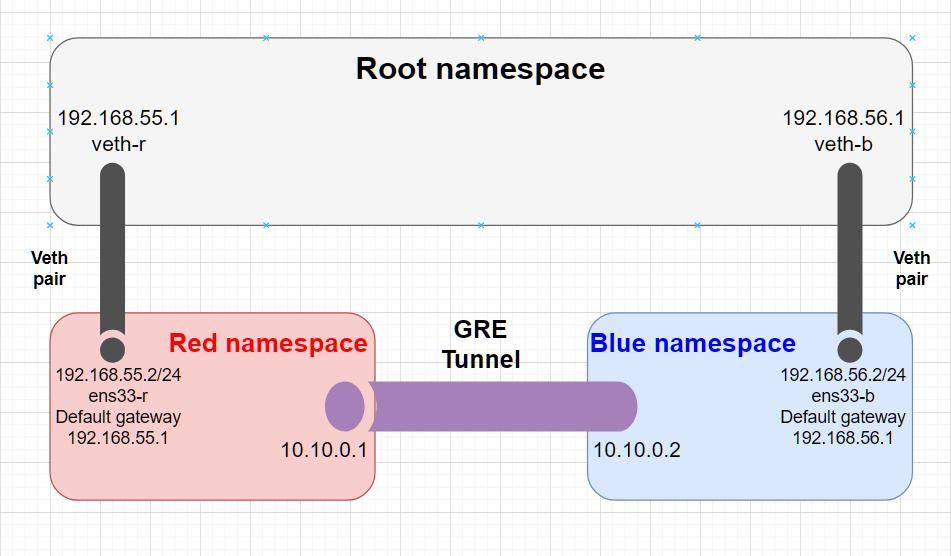
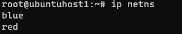
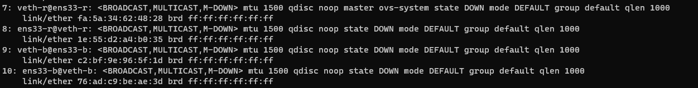
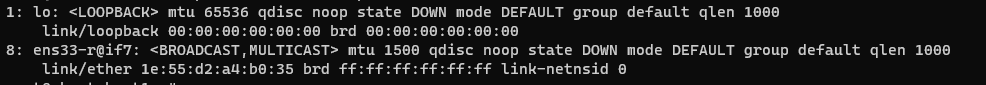
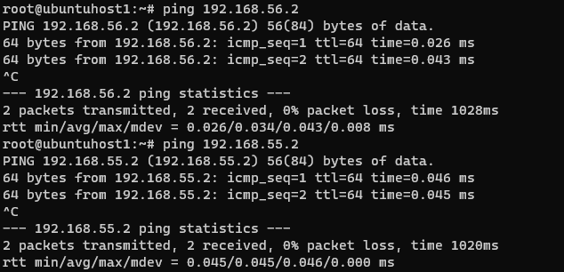
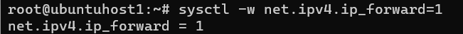
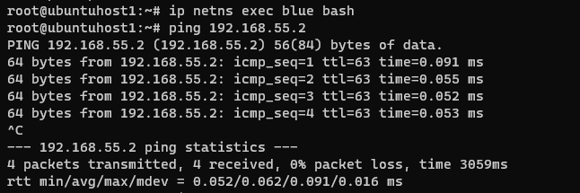
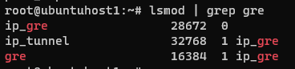
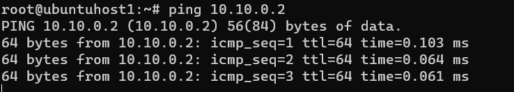

# GRE Tunnel

## Thực hành

### 1. Mô hình

2 namespace `red` và `blue` giả lập 2 network node:

- Red:
  - IP 192.168.55.2
  - Gateway: 192.168.55.1
- Blue:
  - IP 192.168.56.2
  - Gateway: 192.168.56.1
- `Red` và `Blue` nối với `Root` bằng `veth pair` như trong hình.

GRE tunnel tạo giữa 2 node có địa chỉ IP 2 đầu là `10.10.0.1` và `10.10.0.2`.



### 2. Triển khai

#### Tạo 2 namespace `red` và `blue`

```bash
ip netns add red
ip netns add blue
```

```bash
ip netns
```



#### Tạo `veth pair` giữa các namespace với `root`.

```bash
ip link add ens33-r type veth peer name veth-r
ip link add ens33-b type veth peer name veth-b
```

```bash
ip link
```



_Note: `veth-r` đang có config: `master ovs-system` do bài lab về OVS trước. Để sửa thì em đã del-port `veth-r` trong OVS cũ._

Đưa các interface về namespace tương ứng.

```bash
ip link set ens33-r netns red
ip link set ens33-b netns blue
```

Kiểm tra các interface trong `red`.


#### Gán địa chỉ IP cho các interface.

```bash
ip addr add 192.168.55.1/24 dev veth-r
ip addr add 192.168.56.1/24 dev veth-b
ip netns exec red ip addr add 192.168.55.2/24 dev ens33-r
ip netns exec blue ip addr add 192.168.56.2/24 dev ens33-b
```

Bật các interface.

```bash
ip link set veth-r up
ip link set veth-b up
ip netns exec red ip link set ens33-r up
ip netns exec blue ip link set ens33-b up
```

Cấu hình default gateway.

```bash
ip netns exec red ip route add default via 192.168.55.1
ip netns exec blue ip route add default via 192.168.56.1
```

Hiện đã có thể ping tới `red` và `blue` từ `root`.


Để có thể ping từ `blue` tới `red` và ngược lại:
Bật Ip forwarding trên `root`

```bash
sysctl -w net.ipv4.ip_forward=1
```




#### GRE tunnel

Load `GRE kernel module`

```bash
modprobe ip_gre
lsmod | grep gre
```



Tạo tunnel với interface `gre1`. Config local và remote IP tương ứng với các namespace và bật các interface lên.

```bash
ip netns exec red ip tunnel add gre1 mode gre local 192.168.55.2 remote 192.168.56.2 ttl 255
ip netns exec red ip link set gre1 up
```

```bash
ip netns exec blue ip tunnel add gre1 mode gre local 192.168.56.2 remote 192.168.55.2 ttl 255
ip netns exec blue ip link set gre1 up
```

Gán IP cho tunnel

```bash
ip netns exec red ip addr add 10.10.0.1/24 dev gre1
ip netns exec blue ip addr add 10.10.0.2/24 dev gre1
```

GRE tunnel đã được tạo giữa `red` và `blue`.
Từ bash của `red`, thử ping tới `10.10.0.2`

```bash
ip netns exec red bash
ping 10.10.0.2
```



## Tham khảo

[Linux network namespaces and GRE | Ring Zraw (wordpress.com)](https://ringzraw.wordpress.com/2014/09/14/linux-network-namespaces-and-gre/)
[How to create a GRE tunnel on Linux (xmodulo.com)](https://www.xmodulo.com/create-gre-tunnel-linux.html)
