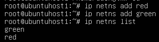

# Linux network namespace LAB

## 1. Giới thiệu

### 1.1. Linux Namespace

Trong Linux, `namespace` là tính năng giúp hệ điều hành tạo các môi trường cô lập một vài tài nguyên hệ thống sẽ bị giới hạn hoặc phân cách hoàn toàn với phần còn lại của hệ thống.

### 1.2. Network Namespace

`Network Namespace` là 1 loại namespace trong Linux, cho phép tiến trình có stack mạng riêng cô lập.
Mỗi network namespace có riêng cho nó các interfaces, routing tables, iptables rules và các configuration mạng, phân tách hoàn toàn với `root` namespace (namespace mặc định của hệ thống) và các network namespace khác.

## 2. Thực hành network namespace

#### Để làm việc với linux namespace

```
ip netns ...
```

### 2.1. Mô hình


2 namespace `red` và `green` được kết nối với nhau qua `Open vSwitch` sử dụng `veth` (virtual ethernet).

### 2.2. Thực hành

#### Tạo 2 network namespace `red` và `green` .

```bash
ip netns add red
ip netns add green
```

List các network namespace.

```bash
ip netns list
# or
ip netns
```



`red` và `green` cô lập với nhau và với `root` namespace.
Để liệt kê các interface của host.

```bash
ip link
```


Để chạy các câu lệnh trong namespace cụ thể:

```bash
ip netns exec <NameSpace> ip <command>
# or
ip -n <namespace> <command>
```

Liệt kê các interface của `red`.

```bash
ip netns exec red ip link
```


_Ở `red` chỉ có loopback interface._

#### Tạo openvswitch

```bash
ovs-vsctl add-br OVS1
```


Interface OVS1 đã được thêm trong `root namespace`.


#### Tạo virtual ethernet

`veth` như 1 đường ống có thể dùng để kết nối network namespace. `veth` pair có 2 đầu, lưu lượng từ interface này được đưa ra interface còn lại.

Để tạo 1 `veth pair` :

```bash
ip link add <interface1> type veth peer name <interface2>
```

Tạo `veth pair` giữa `red` và `ovs`

```
ip link add ens33-r type veth peer name veth-r
```

Tạo `veth pair` giữa `green` và `ovs`

```
ip link add ens33-g type veth peer name veth-g
```

Các interface trên đang ở `root` namespace.


#### Gán các interface vào namespace tương ứng

Kết nối `ens33-r` với `red`

```bash
ip link set ens33-r netns red
```

`ens33-r` hiện đã ở `red namespace`


Kết nối `veth-r` với OVS1

```bash
ovs-vsctl add-port OVS1 veth-r
```


Tương tự với `green`

```bash
ip link set ens33-g netns green
ovs-vsctl add-port OVS1 veth-g
```

Bật các interface trên

```bash
ip netns exec red ip link set ens33-r up
ip netns exec red ip link set lo up
ip netns exec green ip link set ens33-g up
ip netns exec green ip link set lo up

ip link set veth-r up
ip link set veth-g up
```

#### Gán địa chỉ IP

Gán địa chỉ `10.0.0.1` cho `red namespace`

```bash
ip netns exec red ip address add 10.0.0.1/24 dev ens33-r
```


Gán địa chỉ `10.0.0.2` cho `green namespace`

```bash
# co the dung lenh sau de vao namespace ma khong can them ip netns
ip netns exec green bash
ip address add 10.0.0.2/24 dev ens33-g
ip a
```


#### Ping giữa 2 namespace

Exec bash vào green namespace và ping đến red 10.0.0.1


Giờ đã có thể ping giữa 2 `namespace`.

## Tham khảo

[Network Namespaces Basics Explained in 15 Minutes - YouTube](https://www.youtube.com/watch?v=j_UUnlVC2Ss)
[Giới thiệu về không gian tên mạng Linux - YouTube](https://www.youtube.com/watch?v=_WgUwUf1d34)
