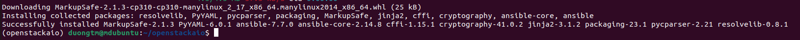
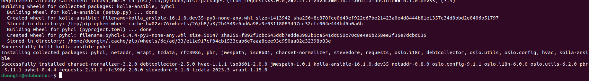
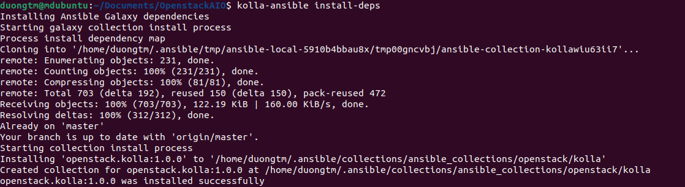
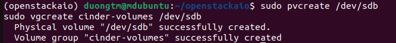
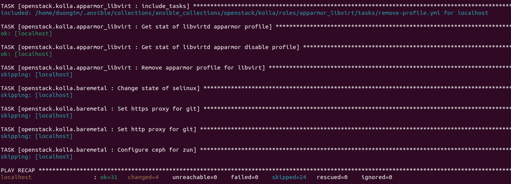
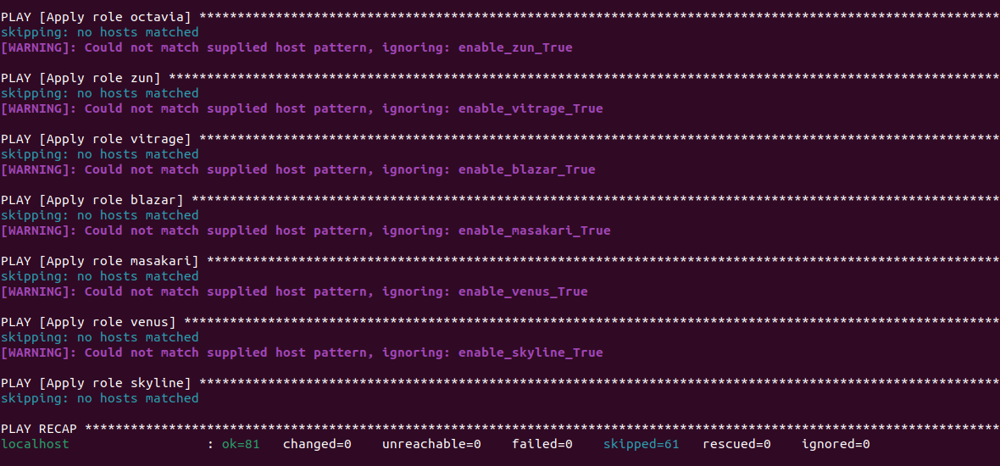
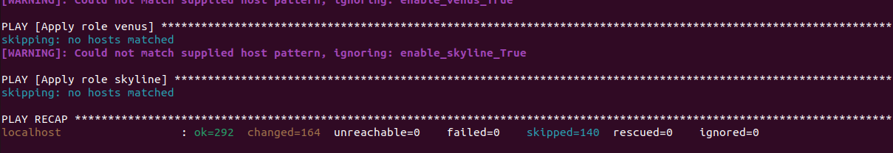
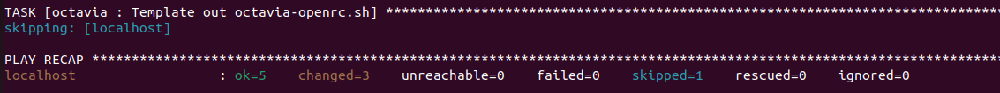
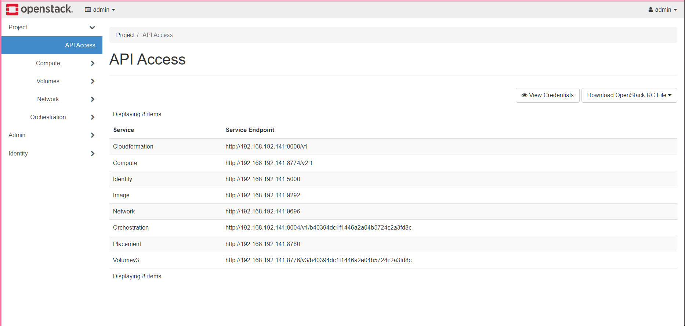

# Dựng Openstack AIO bằng Kolla-ansible.

### Chuẩn bị môi trường

VM ubuntu 22.04
Spec | |
------|-------
CPU| 4
RAM | 6GB
Disks | 2
Network | 2 NICs

Cài đặt `docker`, các `dependencies` cần thiết.

### Install the virtual environment dependencies.

Tạo virtual environment.

```bash
python3 -m venv /home/duongtm/openstackaio
source /home/duongtm/openstackaio/bin/activate
```

Cài đặt latest version của `pip`

```bash
pip install -U pip
```

Cài đặt `Ansible`

```bash
pip install 'ansible>=6,<8'
```



### Install Kolla-ansible

Cài đặt `kolla-ansible`

```bash
pip install git+https://opendev.org/openstack/kolla-ansible@master
```



Tạo thư mục `/etc/kolla`

```bash
sudo mkdir -p /etc/kolla
sudo chown $USER:$USER /etc/kolla
```

Copy `globals.yml` and `passwords.yml` to `/etc/kolla` directory.

```bash
cp -r /home/duongtm/openstackaio/share/kolla-ansible/etc_examples/kolla/* /etc/kolla
```

Copy `all-in-one` inventory file to the current directory

```bash
cp /home/duongtm/openstackaio/share/kolla-ansible/ansible/inventory/all-in-one .
```

### Install Ansible Galaxy requirements

Install Ansible Galaxy dependencies:

```bash
kolla-ansible install-deps
```



### Prepare initial configuration

Tạo password trong `/etc/kolla/passwords.yml`

```bash
kolla-genpwd
```

Thêm config trong file `globals.yml`

```
kolla_base_distro: "ubuntu"
kolla_install_type: "source"
network_interface: "ens33"
neutron_external_interface: "ens37"
kolla_internal_vip_address: "192.168.192.141"
nova_compute_virt_type: "qemu"
enable_haproxy: "no"

enable_cinder: "yes"
enable_cinder_backup: "no"
enable_cinder_backend_lvm: "yes"
```

### Tạo phân vùng cho `Cinder`

```bash
sudo apt install lvm2
```

```bash
sudo pvcreate /dev/sdb
sudo vgcreate cinder-volumes /dev/sdb
```



### Deployment

Bootstrap servers with kolla deploy dependencies

```bash
kolla-ansible -i all-in-one bootstrap-servers
```



pre-deployment checks

```bash
kolla-ansible -i ./all-in-one prechecks
```



Deploy:

```bash
kolla-ansible -i ./all-in-one deploy
```



Post-deploy:

```bash
kolla-ansible -i all-in-one post-deploy
```



### Sử dụng

Cài các package client.

```bash
pip install python-openstackclient python-glanceclient python-neutronclient
```

Cấu hình, kiểm tra dịch vụ:

```bash
source /etc/kolla/admin-openrc.sh
```

```bash
openstack token issue
```

Lấy mật khẩu admin:

```bash
cat /etc/kolla/passwords.yml | grep keystone_admin
```

Vào địa chỉ ip của máy và đăng nhập:


## Tham khảo

[Quick Start for deployment/evaluation — kolla-ansible 16.1.0.dev35 documentation (openstack.org)](https://docs.openstack.org/kolla-ansible/latest/user/quickstart.html)
